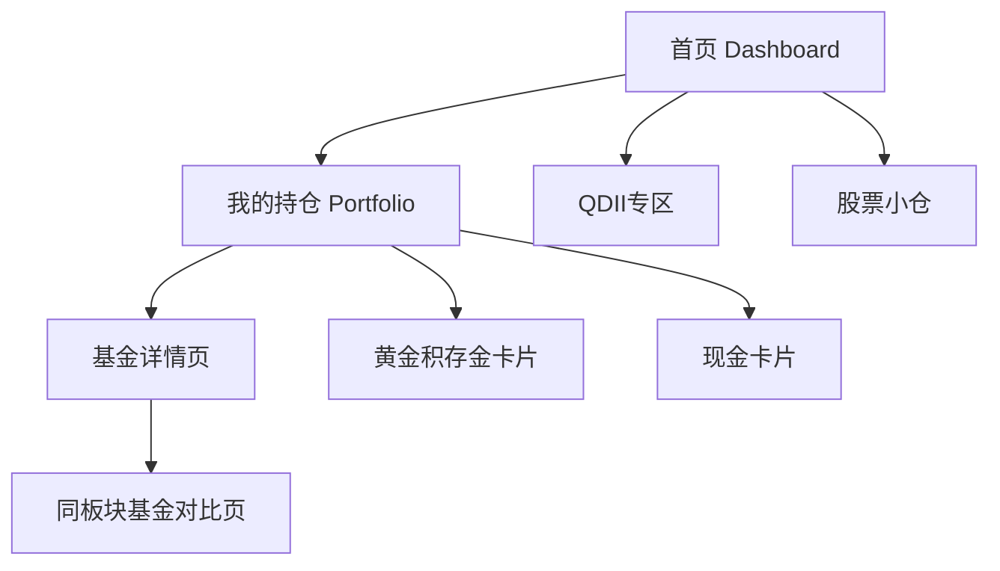

# 个人投资 AI Matrix 系统 Review Brief

请你作为产品经理、前端架构师、移动端 UX 设计师和个人投资管理工具顾问，review 下面这个系统设计。

注意：这是个人投资记录和辅助判断工具，不是公开投顾平台。所有建议都必须以“仅供个人参考，不构成投资建议”为边界。

## 一句话定位

移动端优先的个人投资 AI Matrix，用于统一查看基金、黄金积存金、小仓股票、现金，并辅助判断基金是否在同板块内足够优秀，是否需要观察换基。

## 技术栈

- Next.js
- TypeScript
- Tailwind CSS
- shadcn/ui 风格本地组件
- ECharts
- 当前阶段使用 mock data，不接真实接口
- 适配手机浏览器/PWA

## 页面结构



## 路由

- `/`：首页 Dashboard
- `/portfolio`：我的持仓
- `/funds/[code]`：基金详情页
- `/funds/[code]/comparison`：同板块基金对比页
- `/qdii`：QDII专区
- `/stocks`：股票小仓页

## 1. 首页 Dashboard

首页是移动端第一屏，重点回答“今天我的投资组合怎么样”。

模块：

- 总资产
- 今日估算收益
- 今日确认收益
- 累计收益
- 组合收益率
- 基金/黄金/股票/现金占比环图
- 今日市场状态
- 今日操作建议
- 风险提醒
- AI建议列表

首页建议示例：

1. 纳指基金：QDII收益存在T+2延迟，今日显示为估算值，不建议根据单日估算收益频繁操作。
2. 黄金：当前仓位偏高，建议暂停新增。
3. 半导体基金：当前持有基金近6个月弱于同板块平均，建议加入观察换基名单。
4. 某股票：今日波动较大，但仓位较小，仅提示风险。

## 2. 我的持仓 Portfolio

资产类型：

- 基金
- 黄金积存金
- 股票
- 现金

每个持仓卡片展示：

- 名称
- 代码
- 资产类型
- 所属板块/主题
- 持仓金额
- 持仓份额
- 成本
- 当前估算价值
- 今日估算收益
- 累计收益
- 收益率
- 持仓占比
- 风险标签

基金卡片额外展示：

- 基金规模
- 基金类型
- 基金公司
- 基金经理
- 最新确认净值
- 盘中估算净值
- 今日估算涨跌
- 持有天数
- 是否满7天
- 赎回费提醒
- 是否QDII
- QDII延迟说明

## 3. 基金详情页

基金详情页回答“这只基金本身是否值得继续持有”。

模块：

- 基本信息
- 基金规模
- 所属板块
- 业绩走势图
- 我的持仓收益
- 同类排名
- 同板块对比入口
- 费用
- 风险指标
- 前十大持仓
- AI分析
- 是否值得继续持有

## 4. 同板块基金对比页

这是系统核心页面，点击某一只基金后自动进入同板块基金对比。

对比维度：

- 基金规模
- 近1周收益
- 近1月收益
- 近3月收益
- 近6月收益
- 近1年收益
- 近3年收益
- 最大回撤
- 波动率
- 夏普比率
- 跟踪误差，指数基金适用
- 费率
- 基金经理任期
- 基金公司
- 限购金额
- 成交/申赎状态
- 是否适合定投

页面输出：

- 当前持有基金在同板块排名
- 是否继续持有
- 是否需要观察
- 是否建议同板块换基
- 推荐替代基金列表
- 换基理由
- 风险提醒

评分逻辑简述：

- 收益维度：近6月、近1年、近3年越高越好
- 风险维度：最大回撤越小越好，波动率越低越好
- 质量维度：夏普比率越高越好，跟踪误差越低越好
- 交易维度：基金规模适中偏大更好，费率越低越好，经理任期越稳定越好
- 状态维度：暂停申购、限购、暂停赎回需要风险提醒

判断逻辑：

- 排名前1/3：继续持有
- 排名中等：需要观察
- 同板块存在显著高分替代基金，且当前长期表现/费率/跟踪误差弱：建议进入同板块换基观察名单

示例：

当前基金：南方纳斯达克100  
同板块：纳指100/QDII  
系统判断：当前基金规模较大，流动性较好，但近1年收益排名中等，费率偏高。可观察替代基金：广发纳指100ETF联接、华安纳指ETF联接。建议暂不立即换，先观察跟踪误差和费率。

## 5. QDII专区

QDII专区重点处理美股基金。

展示内容：

- 纳斯达克100
- 标普500
- 道琼斯
- 美元人民币汇率
- 昨夜美股涨跌
- 估算净值影响
- 确认净值
- 估算收益
- 确认收益
- T+2延迟提醒

QDII收益计算逻辑：

```text
估算收益 = 持有份额 × 估算净值 - 持仓成本
确认收益 = 持有份额 × 最新确认净值 - 持仓成本
估算净值 = 最新确认净值 × (1 + 对应指数涨跌) × (1 + 汇率变化修正)
```

页面明确区分：

- 估算收益
- 确认收益
- 最终以基金公司公布净值为准

## 6. 股票小仓页

股票小仓用于把少量股票一起放进组合查看，而不是作为完整交易系统。

展示字段：

- 股票名称
- 股票代码
- 所属市场
- 所属行业
- 持仓数量
- 持仓成本
- 当前价格
- 今日涨跌
- 今日收益
- 累计收益
- 持仓占比
- 风险提醒

## 7. 数据模型

当前 mock data 设计了这些类型：

```text
FundHolding
FundMarketData
FundPeerComparison
StockHolding
GoldHolding
CashHolding
PortfolioSummary
AIRecommendation
TransactionLog
```

### FundHolding

基金持仓，包含：

- code
- name
- assetType
- theme
- fundType
- fundCompany
- fundManager
- amount
- shares
- costAmount
- costNav
- buyDate
- isQdii
- riskTags

### FundMarketData

基金行情与指标，包含：

- latestConfirmedNav
- previousConfirmedNav
- confirmedDate
- intradayEstimatedNav
- intradayChangePct
- fundSizeYi
- managementFeePct
- custodyFeePct
- salesServiceFeePct
- trackingErrorPct
- maxDrawdownPct
- volatilityPct
- sharpeRatio
- managerTenureYears
- subscriptionStatus
- redemptionStatus
- purchaseLimitAmount
- indexName
- indexChangePct
- fxRate
- fxChangePct
- qdiiDelayDays
- topHoldings
- performanceSeries

### FundPeerComparison

同板块基金对比，包含：

- fundCode
- fundName
- theme
- fundSizeYi
- fundType
- returns
- maxDrawdownPct
- volatilityPct
- sharpeRatio
- trackingErrorPct
- feePct
- managerTenureYears
- fundCompany
- purchaseLimitAmount
- tradingStatus
- suitableForDca

## 8. AI建议模块

每天根据以下信息生成建议：

- 今日市场涨跌
- 我的持仓收益
- 同板块基金排名
- 基金规模是否过小
- 基金是否长期跑输同类
- 是否未满7天
- QDII是否存在T+2延迟
- 黄金仓位是否过高
- 股票是否异常波动

建议类型：

- 继续持有
- 继续定投
- 暂停买入
- 观察换基
- 建议同板块替换
- 不建议卖出，未满7天
- 风险过高，降低仓位

每条建议都必须展示：

```text
仅供个人参考，不构成投资建议。
```

## 当前实现状态

已完成第一阶段：

- 移动端首页
- 我的持仓页
- 基金详情页
- 同板块基金对比页
- QDII专区
- 股票小仓页
- Mock data
- 基础收益计算函数
- QDII收益估算函数
- 基金优选评分函数
- AI建议 mock 生成函数
- ECharts资产占比图、净值走势图、同板块评分图、雷达图

## 请重点 Review

请从以下角度给出具体建议：

1. 页面结构是否覆盖了个人投资管理的核心路径？
2. 移动端信息层级是否清晰，是否过重？
3. 首页是否能快速回答“今天我的组合怎么样”？
4. 持仓卡片字段是否足够完整，是否需要折叠/分组？
5. 基金详情页是否能支持“是否继续持有”的判断？
6. 同板块对比页的指标是否足够支持“是否观察换基”？
7. QDII专区是否清楚地区分估算收益、确认收益和T+2延迟？
8. 股票小仓是否应该弱化交易属性，强调风险和占比？
9. AI建议是否过于像投顾？如何进一步降低合规风险？
10. 数据模型是否适合未来接入真实接口？
11. 基金优选评分逻辑是否合理？权重是否需要调整？
12. 还有哪些 UX、计算逻辑、风控提示、数据字段可以补强？

请用“高优先级 / 中优先级 / 低优先级”输出改进建议，并尽量具体到页面和模块。
